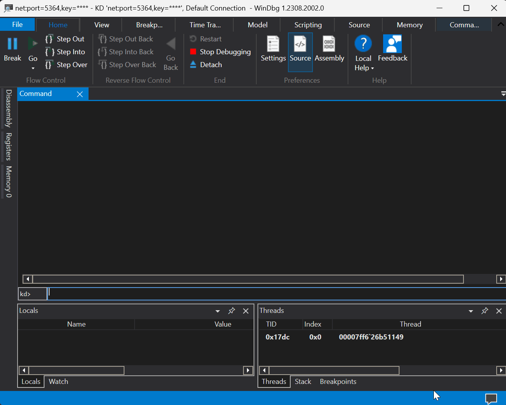

# snapshot: A WinDbg extension written in Rust that generates a snapshot for fuzzing


<p align='center'>

</p>

snapshot is a WinDbg extension written in Rust that dumps both the state of a CPU and the physical memory of a running VM. This snapshot is meant to be used by snapshot-based fuzzers and more particularly by [wtf](https://github.com/0vercl0k/wtf).

This code base is also meant as an example of how to write a WinDbg extension in Rust.

## Building & Loading in WinDbg
You can build the extension with the below:
```text
> git clone https://github.com/0vercl0k/snapshot.git
snapshot> cargo build --release
```

If you would rather grab a pre-built extension, grab one on the [releases](https://github.com/0vercl0k/snapshot/releases) page.

Once you have the extension downloaded / compiled, you can load it in WinDbg with the below:
```text
kd> .load \path\to\snapshot\target\release\snapshot.dll
```

Generate a full-kernel snapshot in the `c:\foo` directory with the below:
```text
kd> !snapshot c:\foo
[snapshot] Dumping the CPU state into c:\foo\state.19041.1.amd64fre.vb_release.191206-1406.20240205_173527\regs.json..
[snapshot] Dumping the memory state into c:\foo\state.19041.1.amd64fre.vb_release.191206-1406.20240205_173527\mem.dmp..
Creating c:\\foo\\state.19041.1.amd64fre.vb_release.191206-1406.20240205_173527\\mem.dmp - Full memory range dump
0% written.
5% written. 1 min 12 sec remaining.
10% written. 1 min 4 sec remaining.
15% written. 59 sec remaining.
20% written. 56 sec remaining.
25% written. 53 sec remaining.
30% written. 50 sec remaining.
35% written. 44 sec remaining.
40% written. 43 sec remaining.
45% written. 48 sec remaining.
50% written. 39 sec remaining.
55% written. 33 sec remaining.
60% written. 28 sec remaining.
65% written. 24 sec remaining.
70% written. 22 sec remaining.
75% written. 17 sec remaining.
80% written. 12 sec remaining.
85% written. 10 sec remaining.
90% written. 6 sec remaining.
95% written. 3 sec remaining.
Wrote 4.0 GB in 1 min 11 sec.
The average transfer rate was 57.7 MB/s.
Dump successfully written
[snapshot] Done!
```

There is also `!snapshot_active_kernel` if you would prefer to grab an active kernel crash-dump.
